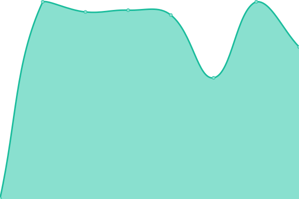

# [📈 Live Status](https://steve-icreationslab.github.io/ICL_UpptimeMonitor): <!--live status--> **🟧 Partial outage**

This repository contains the open-source uptime monitor and status page for [steve-icreationslab](https://steve-icreationslab.github.io/ICL_UpptimeMonitor), powered by [Upptime](https://github.com/upptime/upptime).

With [Upptime](https://upptime.js.org), you can get your own unlimited and free uptime monitor and status page, powered entirely by a GitHub repository. We use [Issues](https://github.com/steve-icreationslab/ICL_UpptimeMonitor/issues) as incident reports, [Actions](https://github.com/steve-icreationslab/ICL_UpptimeMonitor/actions) as uptime monitors, and [Pages](https://steve-icreationslab.github.io/ICL_UpptimeMonitor) for the status page.

<!--start: status pages-->
<!-- This summary is generated by Upptime (https://github.com/upptime/upptime) -->
<!-- Do not edit this manually, your changes will be overwritten -->
<!-- prettier-ignore -->
| URL | Status | History | Response Time | Uptime |
| --- | ------ | ------- | ------------- | ------ |
|  [3eagle.com](https://www.3eagle.com) | 🟩 Up | [3eagle-com.yml](https://github.com/steve-icreationslab/ICL_UpptimeMonitor/commits/HEAD/history/3eagle-com.yml) | 

 148ms
     
 | 

<a href="https://steve-icreationslab.github.io/ICL_UpptimeMonitor/history/3eagle-com">100.00%</a>
    

|  [DS - AllGreen](https://server.allgreen.icreationslabserver.com/) | 🟩 Up | [ds-all-green.yml](https://github.com/steve-icreationslab/ICL_UpptimeMonitor/commits/HEAD/history/ds-all-green.yml) | 

 891ms
     
 | 

<a href="https://steve-icreationslab.github.io/ICL_UpptimeMonitor/history/ds-all-green">100.00%</a>
    

|  [DS - ICL Main 1 OLD](http://icreationslabhosting.com/) | 🟩 Up | [ds-icl-main-1-old.yml](https://github.com/steve-icreationslab/ICL_UpptimeMonitor/commits/HEAD/history/ds-icl-main-1-old.yml) | 

 709ms
     
 | 

<a href="https://steve-icreationslab.github.io/ICL_UpptimeMonitor/history/ds-icl-main-1-old">100.00%</a>
    

|  [DS - ICL Main 2 OLD](https://ds.icreationslabserver.com/) | 🟩 Up | [ds-icl-main-2-old.yml](https://github.com/steve-icreationslab/ICL_UpptimeMonitor/commits/HEAD/history/ds-icl-main-2-old.yml) | 

 910ms
     
 | 

<a href="https://steve-icreationslab.github.io/ICL_UpptimeMonitor/history/ds-icl-main-2-old">100.00%</a>
    

|  [DS - SHBC](https://server.shbc.com.sg/) | 🟥 Down | [ds-shbc.yml](https://github.com/steve-icreationslab/ICL_UpptimeMonitor/commits/HEAD/history/ds-shbc.yml) | 

 0ms
     
 | 

<a href="https://steve-icreationslab.github.io/ICL_UpptimeMonitor/history/ds-shbc">0.00%</a>
    

|  [DS - SHF](https://server.myheart.org.sg/) | 🟥 Down | [ds-shf.yml](https://github.com/steve-icreationslab/ICL_UpptimeMonitor/commits/HEAD/history/ds-shf.yml) | 

 0ms
     
 | 

<a href="https://steve-icreationslab.github.io/ICL_UpptimeMonitor/history/ds-shf">0.00%</a>
    

|  [DS - SLEC](https://slec.icreationslabhosting.com/) | 🟥 Down | [ds-slec.yml](https://github.com/steve-icreationslab/ICL_UpptimeMonitor/commits/HEAD/history/ds-slec.yml) | 

 0ms
     
 | 

<a href="https://steve-icreationslab.github.io/ICL_UpptimeMonitor/history/ds-slec">0.00%</a>
    

|  [DS-ICL-MAIN1 NEW](https://15.235.233.103/) | 🟥 Down | [ds-icl-main-1-new.yml](https://github.com/steve-icreationslab/ICL_UpptimeMonitor/commits/HEAD/history/ds-icl-main-1-new.yml) | 

 0ms
     
 | 

<a href="https://steve-icreationslab.github.io/ICL_UpptimeMonitor/history/ds-icl-main-1-new">0.00%</a>
    

|  [DS-KUOKGROUP](https://kuokgroup.server.icreationslab.com:2083/) | 🟥 Down | [ds-kuokgroup.yml](https://github.com/steve-icreationslab/ICL_UpptimeMonitor/commits/HEAD/history/ds-kuokgroup.yml) | 

 0ms
     
 | 

<a href="https://steve-icreationslab.github.io/ICL_UpptimeMonitor/history/ds-kuokgroup">0.00%</a>
    

|  [iCreations - VPS PLESK Doverpark](https://vps.doverpark.org.sg:8443/login_up.php) | 🟥 Down | [i-creations-vps-plesk-doverpark.yml](https://github.com/steve-icreationslab/ICL_UpptimeMonitor/commits/HEAD/history/i-creations-vps-plesk-doverpark.yml) | 

 0ms
     
 | 

<a href="https://steve-icreationslab.github.io/ICL_UpptimeMonitor/history/i-creations-vps-plesk-doverpark">0.00%</a>
    

|  [I Creations Lab backup server](https://server.icreationslab.com/) | 🟩 Up | [i-creations-lab-backup-server.yml](https://github.com/steve-icreationslab/ICL_UpptimeMonitor/commits/HEAD/history/i-creations-lab-backup-server.yml) | 

 682ms
     
 | 

<a href="https://steve-icreationslab.github.io/ICL_UpptimeMonitor/history/i-creations-lab-backup-server">100.00%</a>
    

|  [VPS - ICL](https://icl.server.icreationslab.com/) | 🟩 Up | [vps-icl.yml](https://github.com/steve-icreationslab/ICL_UpptimeMonitor/commits/HEAD/history/vps-icl.yml) | 

 693ms
     
 | 

<a href="https://steve-icreationslab.github.io/ICL_UpptimeMonitor/history/vps-icl">100.00%</a>
    

|  [VPS - OAS](https://18.142.195.18/) | 🟥 Down | [vps-oas.yml](https://github.com/steve-icreationslab/ICL_UpptimeMonitor/commits/HEAD/history/vps-oas.yml) | 

 0ms
     
 | 

<a href="https://steve-icreationslab.github.io/ICL_UpptimeMonitor/history/vps-oas">0.00%</a>
    

|  [VPS - SDF](https://server.sundownfestival.com/) | 🟩 Up | [vps-sdf.yml](https://github.com/steve-icreationslab/ICL_UpptimeMonitor/commits/HEAD/history/vps-sdf.yml) | 

 758ms
     
 | 

<a href="https://steve-icreationslab.github.io/ICL_UpptimeMonitor/history/vps-sdf">100.00%</a>
    

|  [VPS - TET](https://server.theenchantedtree.com.sg/) | 🟩 Up | [vps-tet.yml](https://github.com/steve-icreationslab/ICL_UpptimeMonitor/commits/HEAD/history/vps-tet.yml) | 

 695ms
     
 | 

<a href="https://steve-icreationslab.github.io/ICL_UpptimeMonitor/history/vps-tet">100.00%</a>
    

|  [VPS-MOBY](https://51.79.250.151/) | 🟥 Down | [vps-moby.yml](https://github.com/steve-icreationslab/ICL_UpptimeMonitor/commits/HEAD/history/vps-moby.yml) | 

 0ms
     
 | 

<a href="https://steve-icreationslab.github.io/ICL_UpptimeMonitor/history/vps-moby">0.00%</a>
    

|  [DVPS-MPP-EU1](https://mpp-eu1.server.icreationslab.com/) | 🟩 Up | [dvps-mpp-eu-1.yml](https://github.com/steve-icreationslab/ICL_UpptimeMonitor/commits/HEAD/history/dvps-mpp-eu-1.yml) | 

 337ms
     
 | 

<a href="https://steve-icreationslab.github.io/ICL_UpptimeMonitor/history/dvps-mpp-eu-1">100.00%</a>
    

|  [VPS-RSAN](https://rsan.server.icreationslab.com/) | 🟩 Up | [vps-rsan.yml](https://github.com/steve-icreationslab/ICL_UpptimeMonitor/commits/HEAD/history/vps-rsan.yml) | 

 699ms
     
 | 

<a href="https://steve-icreationslab.github.io/ICL_UpptimeMonitor/history/vps-rsan">100.00%</a>
    

|  [VPS-THHG](https://server.thhg.sg/) | 🟩 Up | [vps-thhg.yml](https://github.com/steve-icreationslab/ICL_UpptimeMonitor/commits/HEAD/history/vps-thhg.yml) | 

 733ms
     
 | 

<a href="https://steve-icreationslab.github.io/ICL_UpptimeMonitor/history/vps-thhg">100.00%</a>
    

|  [VPS-TIP](https://tip.server.icreationslab.com/) | 🟩 Up | [vps-tip.yml](https://github.com/steve-icreationslab/ICL_UpptimeMonitor/commits/HEAD/history/vps-tip.yml) | 

 694ms
     
 | 

<a href="https://steve-icreationslab.github.io/ICL_UpptimeMonitor/history/vps-tip">100.00%</a>
    

<!--end: status pages-->

[**Visit our status website →**](https://steve-icreationslab.github.io/ICL_UpptimeMonitor)

## 📄 License

- Powered by: [Upptime](https://github.com/upptime/upptime)
- Code: [MIT](./LICENSE) © [Anand Chowdhary](https://anandchowdhary.com), supported by [Pabio](https://pabio.com)
- Data in the `./history` directory: [Open Database License](https://opendatacommons.org/licenses/odbl/1-0/)
